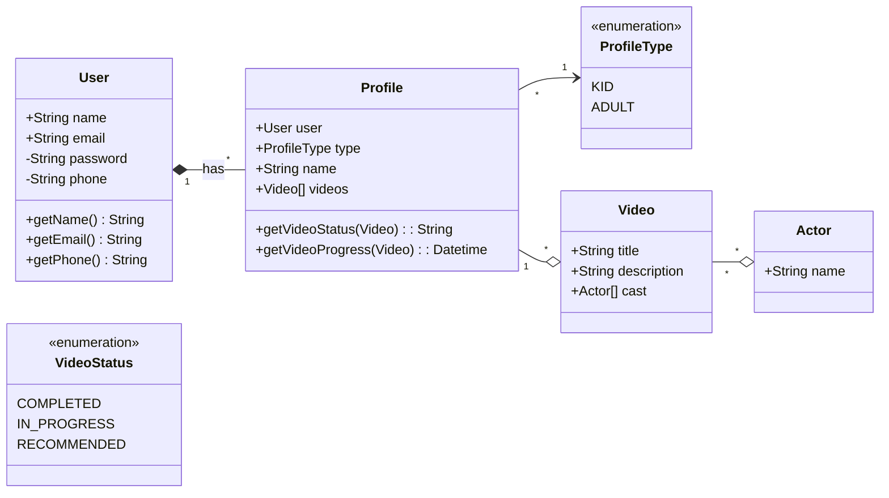
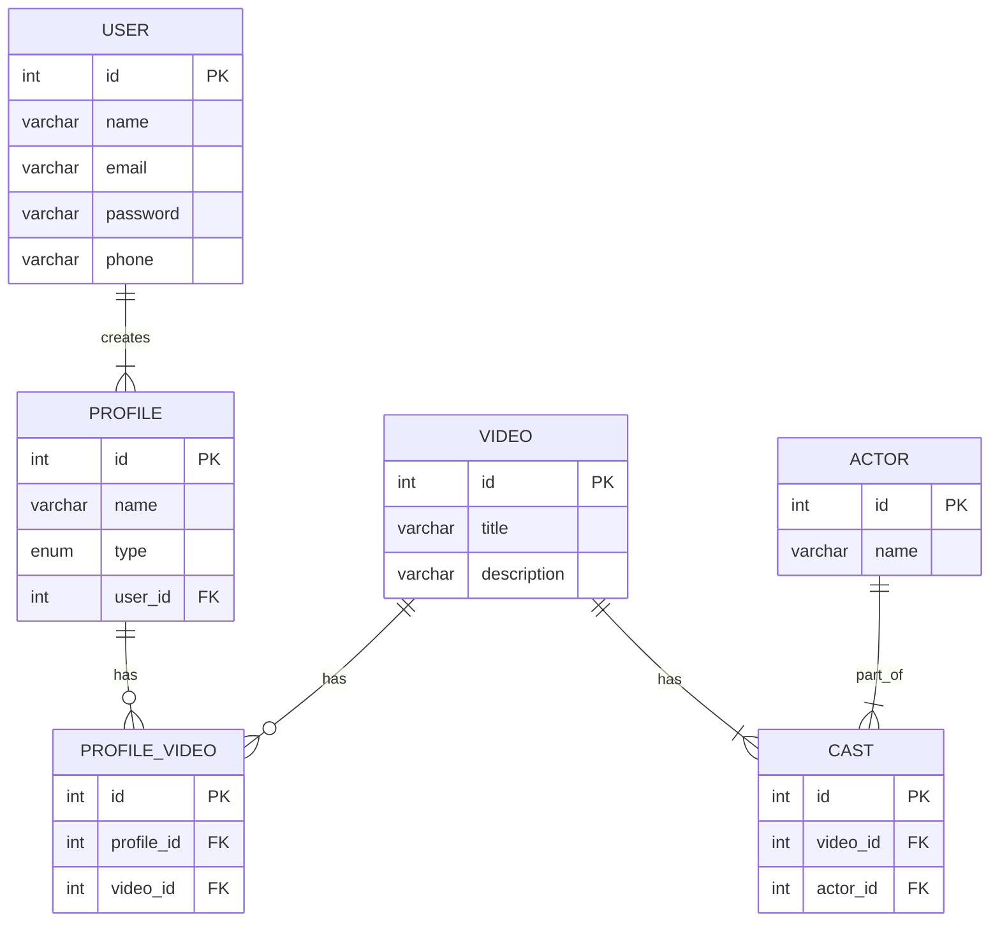

## Exercise

Design the class Diagram and database Schema for a system like Netflix with following Use Cases.

* Netflix has users.
* Every user has an email and a password.
* Users can create profiles to have separate independent environments.
* Each profile has a name and a type. Type can be KID or ADULT.
* There are multiple videos on netflix.
* For each video, there will be a title, description and a cast.
* A cast is a list of actors who were a part of the video. For each actor we need to know their name and list of videos they were a part of.
* For every video, for any profile who watched that video, we need to know the status (COMPLETED/ IN PROGRESS).
* For every profile for whom a video is in progress, we want to know their last watch timestamp.

## Solution

#### Class Diagram

#### ER Diagram

